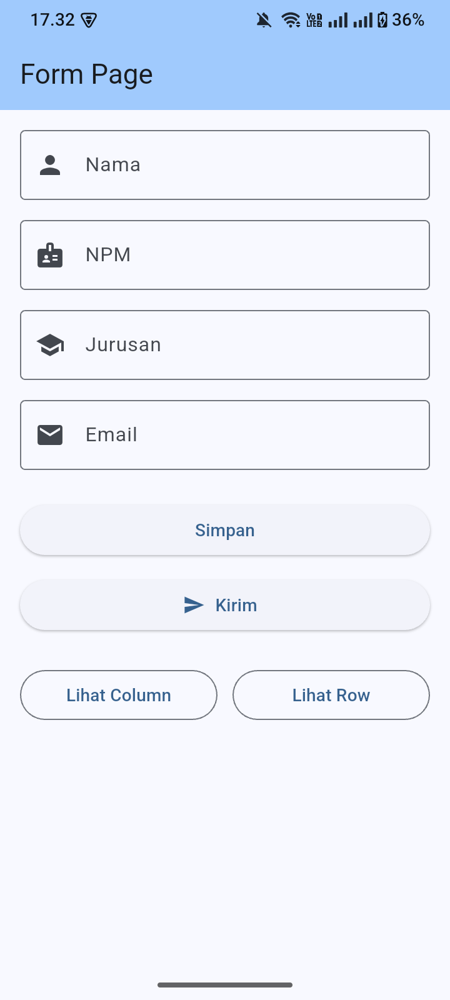
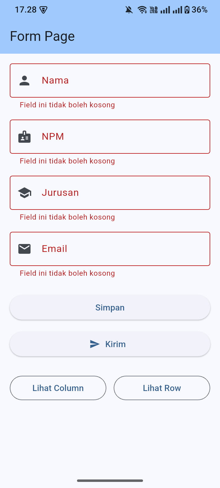
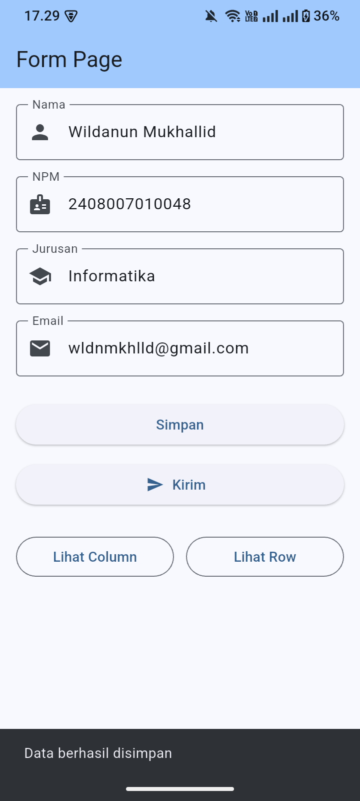
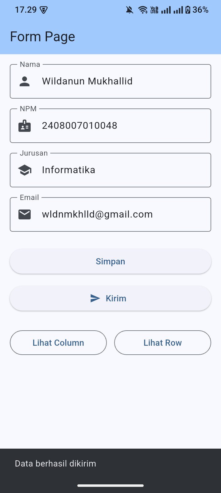
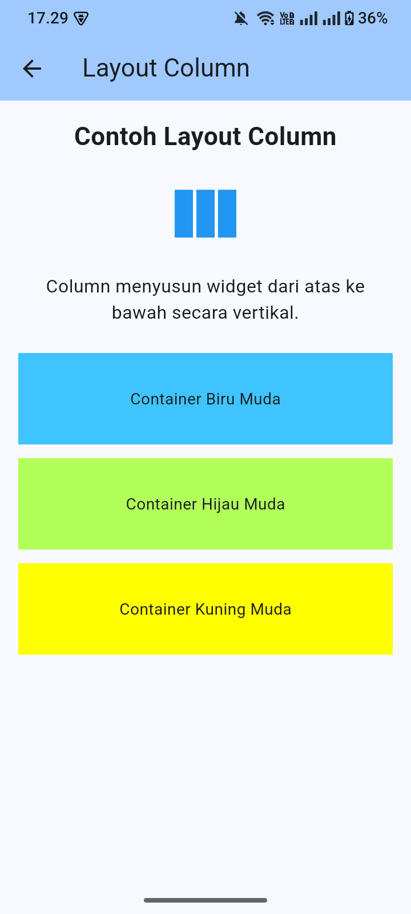
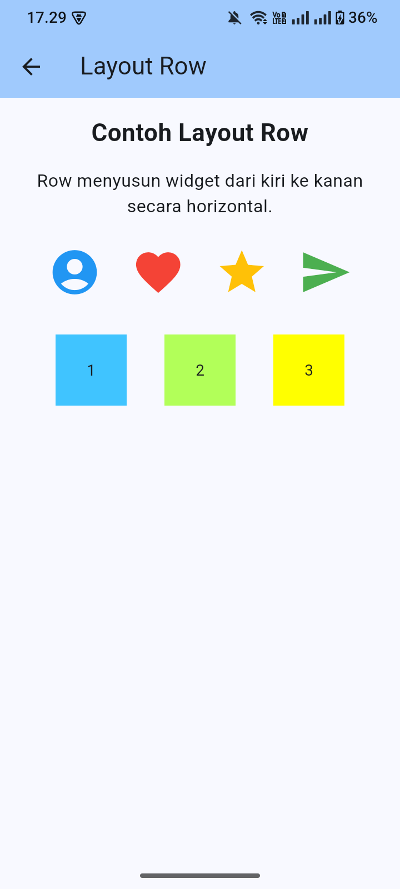
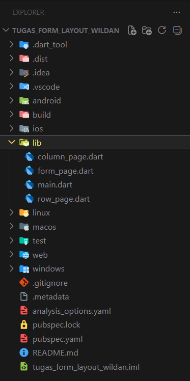

# Tugas Flutter - Form, Column, dan Row

## Deskripsi

Aplikasi ini dibuat untuk memenuhi tugas membuat file baru `form_page.dart`, menampilkan `FormPage` sebagai halaman utama, membuat Form sederhana dengan beberapa `TextFormField`, Button tanpa icon, Button dengan icon, serta contoh layout `Column` dan `Row` di Flutter.

## Struktur Folder

```text
lib/
├── main.dart
├── form_page.dart
├── column_page.dart
└── row_page.dart
```

## Penjelasan File

- `main.dart`: menjalankan aplikasi dan memanggil `FormPage` sebagai halaman utama.
- `form_page.dart`: berisi Form sederhana menggunakan `TextFormField`, `ElevatedButton` tanpa icon, dan `ElevatedButton.icon`.
- `column_page.dart`: berisi contoh penggunaan layout `Column`.
- `row_page.dart`: berisi contoh penggunaan layout `Row`.

## Fitur Aplikasi

- `FormPage` tampil sebagai halaman utama.
- Form memiliki field Nama, NPM, Jurusan, dan Email.
- Terdapat validasi ketika field masih kosong.
- Tombol Simpan tanpa icon menampilkan SnackBar "Data berhasil disimpan".
- Tombol Kirim dengan icon menampilkan SnackBar "Data berhasil dikirim".
- Terdapat halaman contoh Layout Column.
- Terdapat halaman contoh Layout Row.

## Cara Menjalankan

```bash
flutter pub get
flutter run
```

## Screenshot/Output

### 1. Tampilan FormPage



### 2. Validasi Form Kosong



### 3. Data Berhasil Disimpan



### 4. Data Berhasil Dikirim



### 5. Tampilan Layout Column



### 6. Tampilan Layout Row



### 7. Struktur Folder Project



## Kesimpulan

Tugas berhasil membuat `FormPage` sebagai halaman utama, menggunakan `TextFormField`, Button dengan icon dan tanpa icon, serta menampilkan contoh layout `Column` dan `Row` di Flutter.
